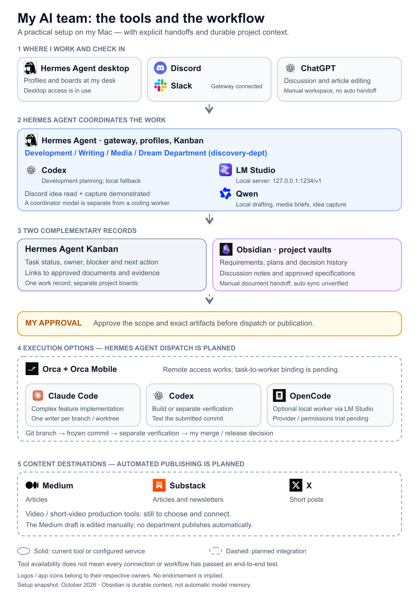

# Hermes Agent AI Team

A manual configuration starter kit for task-centered coordination with specialist
execution. Four reusable department profiles coordinate Development, Writing,
Media, and Discovery (the Dream Department). One authoritative work record links
requirements, decisions and artifacts; larger work can have linked stage tasks.
A shared Kanban system contains separate project and department boards.

A practical reference for organizing a personal AI team around workflows.

This accompanies the [article](article/hermes-ai-departments.md).
No publication is asserted. The kit supplies profile/config examples, instructions,
work records and diagram sources. It contains no installer, stage router, Orca worker
adapter, approval-enforcing executor, publishing connection or spending control.



## Current evidence and planned work

- All four department profiles and local inference are configured.
- The read-only Discord planning interaction has been demonstrated in the setup history.
- Local fallback is configured; automatic end-to-end failover is unverified.
- Discovery board reading, idea creation and read-back through #ideas have been demonstrated in the owner’s test results; evaluation and transfer remain untested.
- Build, Verify, frozen-commit Review, research retrieval, exports and publishing are planned.

Configured means setup exists; Verified requires recorded live evidence. Diagram
capability labels do not show a task's progress or its permission grants. Amber means
owner approval is required, independently of implementation status.

## Files

- `departments/*/`: profile instructions and YAML configuration examples.
- `gateway/config.example.yaml`: shared-bot route examples and default dispatch pause.
- `.env.example`: placeholder Discord variables; merge into an existing file.
- `templates/`: task, handoff and artifact-specific approval records.
- `workflow/stage-policy.yaml`: documented manual stage policy, not an executable router.
- `diagrams/departments.yaml`: explicit capability status and approval fields.
- `diagrams/render.py`: PNG renderer using Playwright, SVG cards, or Graphviz.
- `scripts/build_article.py`: standard-library renderer for the self-contained article HTML.
- `COMPATIBILITY.md` and `VALIDATION.md`: inspected source and actual check limits.

## Manual setup

Install Hermes Agent through its [official quickstart](https://hermes-agent.nousresearch.com/docs/getting-started/quickstart/).
Use LM Studio with a model that fits the machine and supports tool calling. Keep the
Mac awake and connected for remote access. Read `COMPATIBILITY.md` before copying.
For an existing installation, back up `~/.hermes` and merge changes by hand. Never
replace an existing `.env` or complete config file with an example.

### 1 Pause automatic dispatch first

Before creating boards, merge the `kanban` block from `gateway/config.example.yaml`
into the default `~/.hermes/config.yaml`. This pauses automatic dispatch globally.
If the default gateway is already running, reload it:

```bash
hermes -p default gateway restart
```

It does not remove the ability to perform manual Kanban actions. Worker and publishing
permissions require separate enforcement when those integrations are implemented.

### 2 Create fresh profiles and add instructions

Skip profile names that already exist; review their configuration instead.

```bash
hermes profile create development-dept
hermes profile create writing-dept
hermes profile create media-dept
hermes profile create discovery-dept
hermes profile list
```

On newly created profiles only, copy the matching instructions. On existing profiles,
merge them manually so later edits are preserved.

```bash
for d in development writing media; do
  cp departments/$d/SOUL.md ~/.hermes/profiles/$d-dept/SOUL.md
done
cp departments/dream/SOUL.md ~/.hermes/profiles/discovery-dept/SOUL.md
```

Merge the corresponding profile config examples. Copy the templates into each selected
profile's `workspace` directory or attach them to the relevant board tasks. The
`workflow/stage-policy.yaml` file is policy documentation; do not paste it into config.yaml.

### 3 Select models and replace placeholders

Start LM Studio's local server and copy the exact served model ID:

```bash
curl http://127.0.0.1:1234/v1/models
hermes -p development-dept model
hermes -p writing-dept model
hermes -p media-dept model
hermes -p discovery-dept model
```

For Development, use the supported Codex subscription sign-in flow and an account-available
model. The other profiles use LM Studio. Preserve the Development primary `model` block;
replace `YOUR_LOCAL_MODEL_ID` in its local fallback. Verify all example placeholders are
replaced before using the profiles. Subscription access and API billing are separate.
No automatic cloud fallback is declared in the local-only profile examples.

### 4 Create separate boards

Skip boards that already exist. Do not switch the global active board.

```bash
hermes -p default kanban boards create idea-pipeline --name "Dream Department Ideas"
hermes -p default kanban boards create software-project --name "Software Project"
hermes -p default kanban boards create writing-pipeline --name "Writing Pipeline"
hermes -p default kanban boards create media-pipeline --name "Media Pipeline"
```

Always pass `--board` from the CLI. Workflow stages are recorded in task bodies;
native statuses vary by release. Keep implementation blocked until the specification
and execution readiness are approved.

### 5 Connect Discord

Follow the [Discord guide](https://hermes-agent.nousresearch.com/docs/user-guide/messaging/discord).
Add missing variables from `.env.example` to the default profile's existing `.env`;
preserve other settings and never duplicate its bot token into the departments.
Merge the routes and channel prompts from `gateway/config.example.yaml`, using your
actual channel IDs. Use one multiplexing gateway:

```bash
hermes -p default gateway migrate --multiplex --dry-run
hermes -p default gateway migrate --multiplex --yes
hermes -p default gateway status
```

Review the migration preview. If already multiplexed, restart the default gateway to
reload changes. Check that target profiles are served. The channel ID selects a route;
the separate allowed-user ID controls who may talk to the existing bot.

### 6 Verify reading before capture

```bash
hermes -p development-dept fallback list
hermes -p development-dept kanban --board software-project list
```

Mention the bot in the routed channel:

> Read software-project. List existing cards, owners and blockers. Make no changes
> and do not dispatch any worker.

Repeat for idea-pipeline. Then separately test a saved idea, read it back, and record
an explicit owner decision before creating a linked Development planning brief.
Use `/new`, `/profile` and `/model` if an old session retains old settings.
Research, tool calling and fallback each need separate live checks.

## Editing and validation

Edit `diagrams/departments.yaml` or `diagrams/html/roles-vs-tasks.html`, then regenerate:

```bash
uv run --with playwright playwright install chromium  # official Playwright browser, first time only
uv run diagrams/render.py
# Browser-free version of the original rounded-card style (requires librsvg):
uv run diagrams/render.py --engine cards
# Alternative Graphviz layout:
uv run diagrams/render.py --engine graphviz
python3 scripts/build_article.py
```

The renderer declares its Python dependencies. Graphviz is needed for overview.png;
without it the renderer reports that the overview was skipped. Check timestamps before
bundling. To mark a stage Verified, record the supporting evidence before changing its
`capability_status`; approval requirements remain separate.

Run `uv run scripts/check_consistency.py` for offline structure checks. These do not
establish live gateway, model, worker, or publishing behavior. Do not commit real
credentials, local runtime databases, private board content or filesystem backups.

## License

Code and config: [MIT](LICENSE). Article text and diagrams: CC BY 4.0, as specified in
the supplied package. Preserve attribution when adapting them.


The article uses `diagrams/png/Hermes_Fig_Overview.png`, an owner-supplied image. Diagram rendering does not overwrite it; `overview.dot` remains an alternative editable architecture source.


OpenCode is an optional local Development worker with planned manual handoff. See `workers/opencode/README.md` for the version-scoped analysis example and trial checklist. The supplied overview PNG remains unchanged; the article explains this worker extension.

## Article and reference guide

The main article is shortened to about 1,400 words. Full setup and workflow details remain in article/Setup_and_Workflow_Reference.md. This older reference includes historical status statements; use the main article for the updated Discovery capture status. All previous diagrams are retained as reference assets.

Obsidian vault access is manual/unverified; no automatic synchronization is installed by this pack. The tool map renderer and official-icon origins are in diagrams/render_tools.py and diagrams/logos/sources.json.
