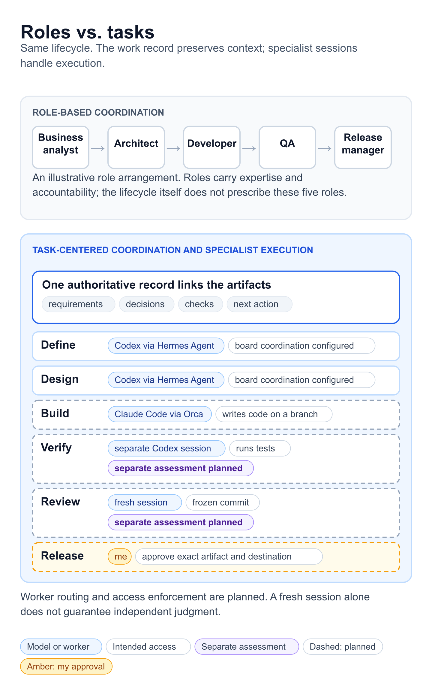
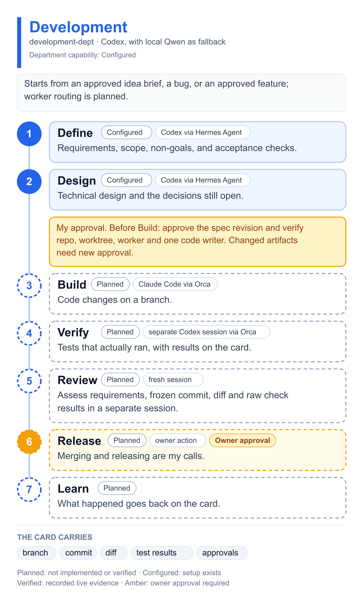
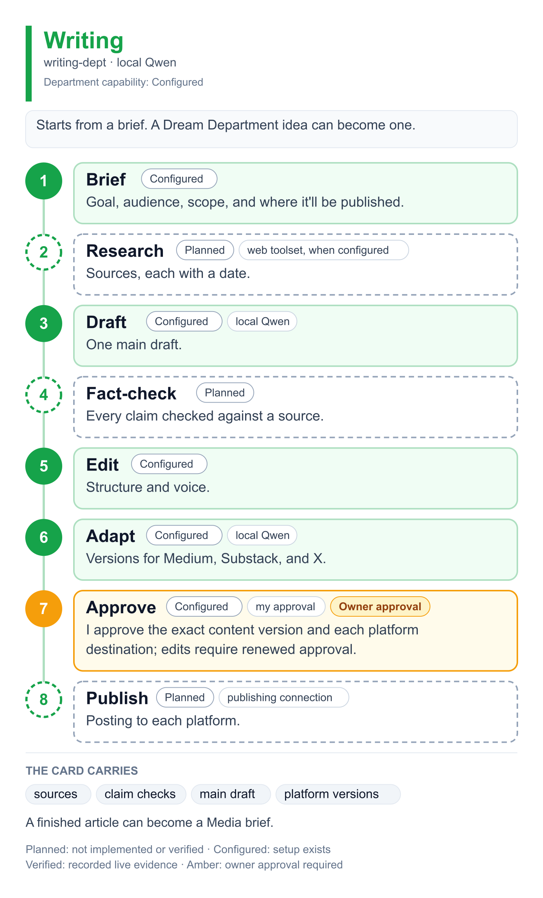
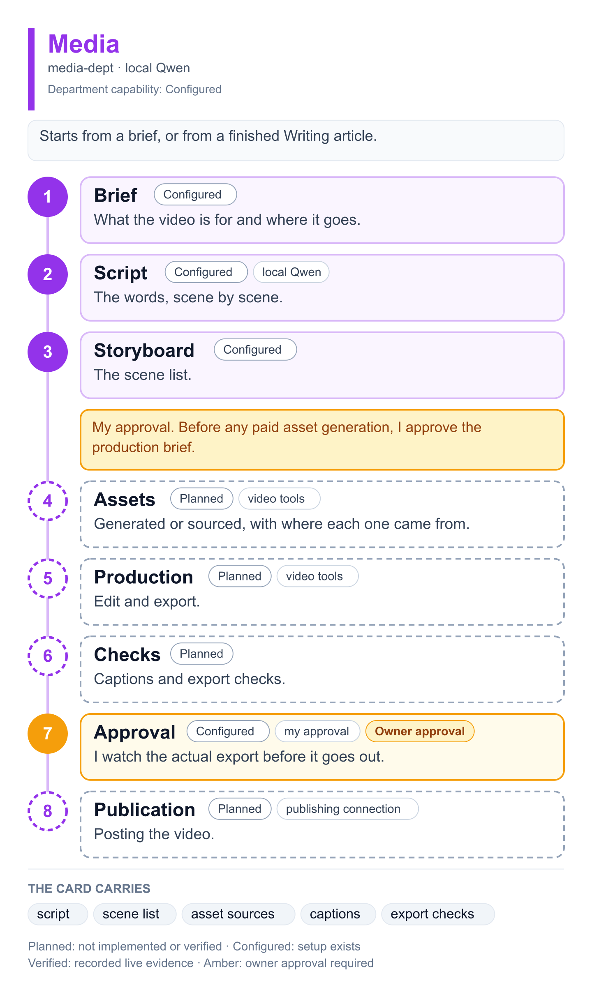
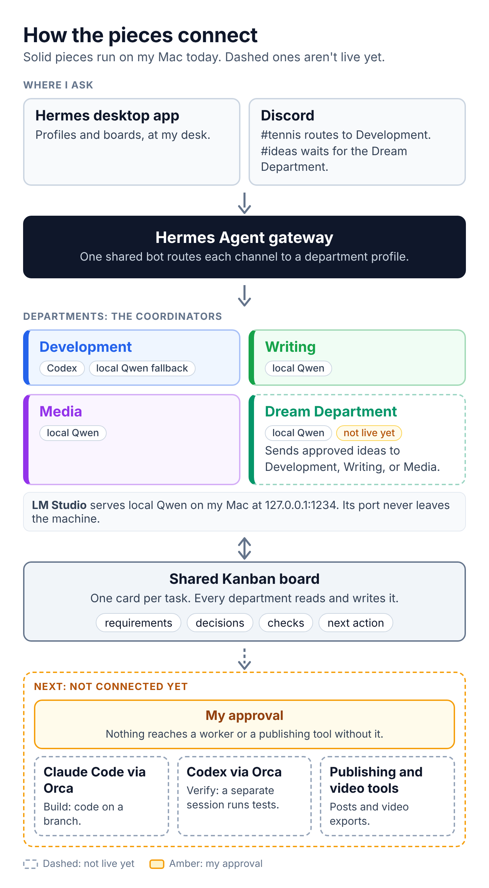

# Building My Own AI Team with Hermes Agent

*How I’m combining local models, coding agents, and creative tools to support my everyday work.*

> Draft article for Medium and Substack; publication has not been verified. The diagrams render from [`diagrams/`](../diagrams), and the setup files live in [`departments/`](../departments) and [`gateway/`](../gateway).

There are now so many AI tools that can work alongside us: turning ideas into code, helping us write articles, and creating videos. As a developer, I kept imagining how I could bring them together into a team that would help me build products, explore new ideas, and create content.

What drew me to **Hermes Agent** was its emphasis on learning from experience and improving through reusable skills. I wanted a setup that could become more useful as we worked together, carrying lessons from one task into the next.

But I kept struggling to turn that ambition into a practical workflow. I had access to powerful tools and different models, yet I was still the person moving context between conversations, deciding what happened next, and keeping track of unfinished work.

Finally, I sat down and decided to build the system I had been imagining. I started with my own work: a tennis app, technical writing, and plans for video content. This article explains how I organized those workflows into departments with Hermes Agent, combined local and cloud models, and kept clear boundaries between what works today and what I still need to connect.

I set up 4 Hermes Agent profiles for my tennis app, Practice Partner: a planner, a developer, a QA, and a reviewer. They shared one Kanban board with the foundation tasks and the requirements I'd signed off on.

That part worked. Each role had a clear job. But pretty soon I was thinking more about the profiles than about the app.

So I removed them and rebuilt the setup around tasks, grouped into departments. Each department is one Hermes Agent profile that coordinates a type of work through its lifecycle.

What I get out of it so far is continuity. A request has somewhere to live, a next step, and a record of what's been checked. I can pick a project back up from my desk or from Discord without starting over.

## The tools I was trying to connect

I already had the pieces:

- Claude Code and Codex for engineering work, plus OpenCode as an optional local coding worker (integration planned).
- Obsidian project vaults for requirements, plans, architecture notes, and discussion history.
- ChatGPT for manual discussion and editing, Discord and Slack for messaging access, and Medium, Substack, and X as content destinations.
- [LM Studio](https://lmstudio.ai/docs/developer/openai-compat) running local models on my Mac.
- [Orca](https://onorca.dev), which runs coding agents in parallel git worktrees, plus Orca Mobile for remote access.
- [Hermes Agent](https://hermes-agent.nousresearch.com/docs/getting-started/quickstart/) from Nous Research. It gives you profiles (separate agents, each with its own config and instructions), a messaging gateway for Discord, and a shared Kanban system with separate project and department boards.

What I didn't have was a place where decisions and requirements carried over between sessions. I wanted to work at my desk, check in from Discord when I'm out, see what's waiting on me, and send each piece of work to a sensible model.

## The complete tool map

*This map includes the tools I use and the integrations I intend to build. Solid boxes mean a current tool or configured service, not a complete workflow certification. Dashed boxes mark planned connections. ChatGPT discussion and Obsidian document handoffs are manual.*

The icons identify the products; they do not imply a partnership or endorsement. Official site icons and installed app icons are used where available. The source pack records their origins and preserves an editable SVG and the diagram renderer.

## From role-based profiles to task-centered coordination

One way to organize software work is to assign lifecycle stages to specialist roles. A business analyst writes the requirements, an architect designs, developers build, QA tests, and a release manager ships. Each handoff carries context in a spec, a design doc, a ticket, or a test report.

That split made sense for people. Specialists get deep at one thing, and nobody can hold a whole system in their head. Handoffs are how a team spreads that load.

So when I set up my first agents, I copied it. Planner, developer, QA, reviewer: 4 profiles and 3 handoffs. Every handoff was one more place where the feature's requirements and decisions had to be passed along.

In my personal setup, I no longer need a persistent profile for every stage. The department preserves continuity, while specialist sessions handle implementation, verification, and review when needed.

In my setup, Codex handles both Define and Design, and local Qwen can prepare test cases. The planned execution stages still need suitable tools, explicit permissions, and checks; sharing a model does not make those requirements disappear.

What still differs from stage to stage is the task itself:

- What it has to produce, and what counts as done.
- Which model it needs. A routine rewrite runs on local Qwen. Technical design goes to Codex.
- What it's allowed to touch. Planning works on the board. Build writes code on a branch. Verify runs tests.
- Whether it needs a separate assessment. Verification and review are planned as separate sessions that receive the requirements, frozen artifact, and raw check results.

That last point is the one piece of the role split I kept on purpose. Whoever builds something shouldn't be the one who signs off on it, and I think that holds for models too.

So I organize the work around tasks. Each card records the required output, proposed model or worker, intended access, checks, and approval. The current configuration chooses coordinator models per profile; automatic routing by a task’s stage is not implemented.

The department supplies the workflow the task moves through. A department is a shelf for one kind of work.

*The same Development stages, organized 2 ways.*

The decisions stay with me; the board makes the preparation easier to track. The amber approval points in the diagrams below sit roughly where the old roles handed off: the spec before Build, the merge, and anything that gets published.

I'm not sure this carries over to a big team as-is. On a team, roles also carry accountability, ownership, and career paths, and tasks don't replace any of that. For one person running a handful of models, though, organizing by task is what made the work easier to follow.

## The 4 departments

Each department profile holds reusable instructions for its process. Project details live on the project's cards, so Development never turns into a tennis-app assistant.

- Development (`development-dept`): software, websites, and mobile apps.
- Writing (`writing-dept`): articles for Medium and Substack, newsletters, and X posts.
- Media (`media-dept`): videos and short videos.
- Dream Department (`discovery-dept`): new ideas, before I commit to building them.

All four profiles are configured. I have tested Development board reading through Discord, and Dream Department board reading and idea capture. Complete development, writing, media, and idea-validation workflows still need testing.

Each one gets its own workflow diagram below. Capability labels distinguish Planned, Configured, and Verified. Amber marks owner approval independently of capability status. Configured means the setup exists, not that the complete stage has passed a live test.

### Development

*Development: 7 stages, 2 points where I approve.*

Today, Define and Design run in Hermes Agent, and the Tennis spec lives there. Build and Verify wait on the Orca workers.

### Writing

*Writing: 8 stages. Publishing isn't connected yet.*

The Writing board is empty for now, waiting for its first brief. When one lands, nothing gets published until I've signed off on step 7.

### Media

*Media: 8 stages, 2 points where I approve.*

A researched article can become a video brief. Writing and Media each keep their own deliverables and approvals.

### Dream Department

As a developer, I come up with more ideas than I have time to build. I wanted somewhere to keep them and test them before spending engineering time.

*Dream Department: 5 stages, ending in my call. The illustration reflects the earlier setup snapshot; Capture and Clarify have since been exercised through Discord.*

It also asks what would make my version useful, and why I'm a good person to build it.

A quick prototype or a few user conversations can teach me more than another round of model scoring. So Validate asks for an experiment with a hypothesis, a time and cost cap, and a result I can actually observe.

An approved software idea becomes a planning brief for Development. It carries the user problem, what I know, what I'm still assuming, scope, non-goals, and how I'll know it worked. It still goes through Development's normal spec stage.

The Dream Department is optional. Bug fixes, approved features, and planned articles go straight to their departments.

The `#ideas` channel now routes to `discovery-dept`. I tested a board read, then asked it to capture a real-estate house-tour scheduling app idea. It created a card in Clarify, read it back, and recorded questions about showing frequency, current scheduling, and willingness to pay. That demonstrates capture and clarification; evaluation, validation, and downstream transfer remain untested. One read-only request also caused a channel rename, so I still need to check that behavior.

## How the pieces connect

*Solid connections are configured; dashed connections are planned. This owner-supplied illustration records an earlier snapshot. Since then, Dream Department board reading and idea capture have also been demonstrated through Discord. Owner approval applies to both configured and planned capabilities.*

I keep 2 jobs separate, because they're easy to blur:

- The coordinator is the department's Hermes Agent profile. It reads the board, plans, and talks to me. Its model is set in Hermes Agent.
- The worker is the session that actually changes code or runs tests, like Claude Code or Codex in an Orca worktree. It uses its own tools.

Setting a coordinator's model doesn't connect a worker. For the tennis app, binding the repo and an Orca worker still has to happen before implementation. Meanwhile, the Development coordinator keeps working on the spec.

Every planned handoff to a worker goes through my approval. A model's answer doesn't authorize anything outside Hermes Agent, no matter how confident it sounds.

## The board holds the work

One authoritative work record links the context and artifacts. Larger features can have linked implementation, verification, and review cards rather than squeezing every result into one body. Each card carries a small packet:

- Goal, audience, scope, and non-goals.
- Current stage and open decisions.
- Links to sources and files.
- Acceptance checks, and what actually got checked.
- Which model or session did the work.
- Blocker, next action, and my approvals.

For development, the packet grows to include the branch, commit, diff, and test results. For writing, it's sources, claim checks, the main draft, and the platform versions. For media, it's the script, scene list, where each asset came from, captions, and export checks.

[Hermes Agent boards](https://hermes-agent.nousresearch.com/docs/user-guide/features/kanban) use native task statuses. The available statuses vary by release; the source inspected for this kit also includes `scheduled`. Workflow stages such as Design stay in the card body instead of becoming assumed custom columns.

"Blocked" says something is stopping progress. "Design" says what the work is doing.

## Obsidian keeps the project memory

I also use a dedicated Obsidian vault for each project. It holds the requirements, project plan, architecture notes, and decisions from our discussions. This gives development sessions a durable reference to return to instead of relying on scattered chat history.

Hermes Agent and the task board coordinate what happens next. Obsidian preserves why we chose that direction. The vault is a document store, not a model that learns automatically from every conversation, and I have not verified an automatic vault-reading or synchronization integration.

I keep discussion notes separate from approved requirements. Before a coding session starts, I provide the relevant documents and identify the exact specification revision it should follow. The Kanban card links to that revision instead of holding a competing copy of the full specification.

For readers setting up the same pattern, a small vault structure is enough:

    Project-Vault/
      00-Project-Brief.md
      01-Requirements.md
      02-Plan.md
      architecture/
      decisions/
      discussions/
      verification/

Each decision note should record the date, decision, reason, alternatives, and linked task. Each approved specification should have a revision or Git commit and acceptance checks. The worker handoff records those identifiers with the repository, branch, allowed actions, and next step. I treat this as durable project context; automatic access is a separate integration to configure and test.

## Which model does what

My Development coordinator runs on Codex through my ChatGPT subscription, with local Qwen as its fallback. Writing and Media run on local Qwen. If a local request fails, nothing quietly upgrades it to a cloud model.

LM Studio serves the local model through its OpenAI-compatible endpoint at `http://127.0.0.1:1234/v1`. The model is `qwen/qwen3.6-35b-a3b`.

- Requirements and technical design: Codex through Hermes Agent.
- Idea capture: local Qwen through the Dream Department, tested through Discord. First-pass evaluation is the next workflow to verify. A deeper cloud review only happens when I hand it off on purpose.
- Outlines, summaries, scripts, and routine rewrites: local Qwen through LM Studio.
- Implementation: Claude Code through Orca (planned), with Codex or OpenCode plus LM Studio as optional workers selected per task.
- Executed QA: a separate Codex session through Orca (planned).
- Final review: a planned separate session that gets the requirements, frozen commit or content version, and raw check results. A fresh session alone does not guarantee an independent judgment.

I picked these for my workflow. I haven't benchmarked the models against each other yet.

## Where OpenCode fits: an optional local development worker

I also have OpenCode. Its useful place in this workforce is inside Development, alongside the other coding workers. Hermes Agent keeps the requirements, decisions, and next action on the board; OpenCode would perform a selected task using a model served by LM Studio.

OpenCode documents support for [local models through LM Studio](https://opencode.ai/docs/providers/#lm-studio). That gives me a way to test local Qwen on repository exploration, documentation, and small, well-defined changes. It is an additional worker option, not a new department. The Hermes Agent and Orca connections to OpenCode have not been established.

For a tennis-app task, I would choose the tools by stage:

- Define and Design: Codex through the Development coordinator prepares the specification and acceptance checks.
- Build: choose one worker. Claude Code or Codex is an option for a complex feature; OpenCode with local Qwen is an option to evaluate for a small task.
- Verify: a separate Codex session checks the submitted commit and reports executed results.
- Review and Release: review the evidence, then I make the merge or release decision.

My first OpenCode trial would be repository analysis with edits and shell execution explicitly denied. Its [agent permissions](https://opencode.ai/docs/agents/) must be checked for the installed version; choosing Plan mode alone is not the same as denying all writes and commands. Once analysis works, I would approve one small task on an isolated branch, inspect the changes, and have a separate session verify them. Tool calling, context limits, and performance of my local Qwen model still need testing.

Only one worker owns code writes for a task and worktree at a time. A switch from Claude Code or Codex to OpenCode requires a handoff containing the repository, branch, commit, changed files, unfinished work, test commands, results, and next action. A provider limit does not automatically authorize a replacement worker, and local Qwen is not assumed to match the capability of the unavailable cloud model.

The reference pack includes a version-scoped OpenCode configuration example and a trial checklist. These are setup references, not an installed integration. I would keep OpenCode on the same Mac and point it at LM Studio's loopback endpoint, then record the approved worker and model on the existing task card.

## How I would combine models for real work

The model list tells me who is available. The useful question is which combination a particular task needs. These are the workflows I intend to use, with manual handoffs until the worker connections are tested. They are operating choices for my setup, not a benchmark showing that one model is universally better.

### A new app idea: local Qwen first, Codex when the decision needs deeper work

Suppose I drop this into #ideas: “Could Practice Partner help players arrange a recurring weekly practice?” Local Qwen would preserve the idea, clarify the user problem, separate assumptions from evidence, and propose a small experiment. Market claims still need dated sources from a configured research tool; a model's familiarity with a topic is not market validation.

If the idea survives that first pass and has substantial engineering implications, I would explicitly send the brief to Codex for a deeper feasibility assessment: scheduling conflicts, cancellation behavior, dependencies, maintenance, and a small first slice. I decide whether it moves to Development. This combination keeps routine idea preparation local and uses a cloud review for a specific unresolved decision. Discovery capture is working; deeper evaluation and that handoff remain to be verified.

### A tennis-app feature: Codex plans, Claude Code builds, a separate Codex session verifies

For a feature such as confirming that a practice happened, Codex through the Development profile would turn the request into a specification with acceptance checks. The spec should cover both participants' confirmations, duplicate requests, privacy, and the expected Practice Journey update.

After I approve the specification and the repository and worktree binding, Claude Code through Orca would implement the agreed slice on a branch. One session owns code writes. A separate Codex session would receive the frozen commit, requirements, and test commands, run the checks, and report actual results. Review then assesses that exact commit and raw evidence before my merge or release decision.

The benefit comes from separate work stages and recorded evidence. Changing model providers does not guarantee independent judgment. Planning is configured; Build, executed Verify, and Review connections are still planned.

### A bug fix: use one builder, then another session for verification

For a narrow bug, I would skip Discovery and start with a reproduction and a regression check. Codex could investigate and implement, or Claude Code could build from the approved diagnosis. I would choose one builder for the task rather than run both against the same files. A separate verification session would reproduce the failure on the baseline and check the fix at the submitted commit.

If the chosen builder reaches its account limit, I would record the branch, commit, changed files, test results, and next action before stopping or transferring ownership. A replacement worker resumes only after I approve the handoff. Local Qwen can summarize that packet; it does not turn an unfinished fix into verified code.

### A technical article: local Qwen drafts, a separate review checks sources and accuracy

For an article like this one, local Qwen would help with the outline, draft, editing, and versions for Medium, Substack, and X. I would supply the actual configuration, logs, and decisions as source material. Once research is connected, retrieved sources would be recorded with dates and links.

For important technical claims, I would explicitly request a separate Codex or Claude review against those sources and the relevant code or configuration. That reviewer should identify unsupported claims and missing evidence. I keep the editorial decision, approve the exact final content for each destination, and only then authorize publication. Local drafting is configured; research, the cloud review handoff, and publishing are planned.

### An article-to-video workflow: local Qwen prepares the script; media tools produce the export

An approved article can become a Media brief. Local Qwen would prepare a short script, scene list, and caption draft. A separate editorial review is useful when compression changes a technical claim, but I would not add a cloud pass to every routine rewrite.

The LLM prepares the production instructions. Connected media tools must generate or source assets, edit, and export the actual video. I approve paid generation before it runs, then watch the final export before publication. This is a planned cross-department workflow; writing a script does not mean the video was produced.

### Daily organization: local summaries, with scheduling performed by the connected system

For school work, gym sessions, and project priorities, local Qwen would summarize a supplied schedule and suggest a daily plan. A deeper Codex or Claude planning session would be an explicit choice for a difficult workload decision, not a requirement for every reminder.

Calendar reads and changes need a calendar connection. Reliable reminders need a scheduler and a delivery channel; an LLM response alone does not schedule a notification. This daily workflow is an extension I have not connected yet.

### When a provider fails: continue only work the fallback can safely support

Development's configured route is Codex with local Qwen fallback. If Codex becomes unavailable, local Qwen can continue permitted summaries, draft acceptance checks, or prepare the next handoff. I would pause a task whose required capability or quality checks are no longer available. Writing and Media stay local-only unless I explicitly request a cloud handoff.

Fallback is recovery from a provider failure. A handoff intentionally transfers a task to another session. Neither automatically changes permissions or approves execution. The fallback route exists, but end-to-end recovery still needs testing.

Across these cases, Hermes Agent preserves the work record. LM Studio serves a local model. Codex and Claude Code are agent runtimes that may use account-available models; they are not fixed model names. The ChatGPT app can be a separate place for a manual conversation, but its subscription and an API connection are different things. I do not treat an app subscription as a general-purpose API credential.

Before requesting a cloud handoff, I would record the approved source material, intended output, selected session, allowed actions, and acceptance checks on the card. Local inference does not make the whole workflow private: cloud reviews and Discord exchange the material sent to them. Sensitive content stays out of a cloud handoff unless I explicitly approve that disclosure.

## The 404 that gave me a fallback policy

One of my first Discord requests failed. The Solar model I'd picked had reached the end of its free period, and the reply came back with an HTTP 404 saying the request hadn't been processed.

The routing was fine. The model config was dead, and no profile had a fallback.

So I changed the primary model and added a local fallback on purpose.

Hermes Agent [switches to the fallback right away](https://hermes-agent.nousresearch.com/docs/user-guide/features/fallback-providers/) on a 404 or an auth error. On rate limits and server errors, it retries first. It falls back at most once per turn.

The policy I settled on is to use fallback for permitted draft work. Switching providers is not a worker handoff or approval. The current setup does not dynamically reduce tool permissions when fallback activates; reduced permissions must be enforced by the future executor if that distinction is required.

Local Qwen can summarize requirements or prepare test cases. If the tests never ran, they still never ran.

I also left out automatic fallback to a paid API for now. Subscription access, API billing, and tool costs each need their own thought.

Creating more profiles doesn't add account capacity. And a prompt asking an agent to stay under budget isn't a spending control.

The local model passed a small simulated tool-call check during setup. I haven't tested end-to-end failover yet, so I'm not calling it reliable.

## Reaching it from Discord

At my desk, I use the Hermes Agent desktop app for profiles and boards. When I'm out, I use Discord. Orca Mobile covers remote access to Orca.

The Tennis channel in my Discord server routes to Development through the same Hermes Agent bot. Discord talks to the Hermes Agent gateway on my Mac, and Hermes Agent calls LM Studio locally, so LM Studio's port never touches the internet. The trade-off is that my Mac has to stay awake with Hermes Agent and LM Studio running.

For the first real test, I kept the ask narrow: read the Tennis board, list the blocked cards and their owners, and name the planning decisions still open. No changes.

The bot came back with all 5 cards, the dependency chain between them, and the project context. It also flagged references whose full text it didn't have.

That last part was what I cared about. It found the right work and told me which context was missing.

Writing code and running tests are separate milestones. I haven't hit those yet.

## Setting it up yourself

This covers the coordination layer only. Workers and publishing come later. Start with the [Hermes Agent quickstart](https://hermes-agent.nousresearch.com/docs/getting-started/quickstart/) and check `hermes --version`, since commands and providers change between releases.

If you already run Hermes Agent, back up your config and merge these snippets in. Your existing files probably hold routes and allowed users you'll want to keep. Capitalized values are placeholders.

### 1. Create the department profiles

    hermes profile create development-dept
    hermes profile create writing-dept
    hermes profile create media-dept
    hermes profile create discovery-dept
    hermes profile list

Each profile gets its own folder under `~/.hermes/profiles/` with its own `config.yaml`, `SOUL.md`, and `.env` ([profiles docs](https://hermes-agent.nousresearch.com/docs/user-guide/profiles)). Start fresh. Copying an old profile drags its credentials and instructions along.

### 2. Find your local model ID

In LM Studio, load a model that fits your Mac's memory and supports tool calling. Start the server on port 1234, then:

    curl http://127.0.0.1:1234/v1/models

Copy the exact `id` it returns. The download filename can be different. Mine is `qwen/qwen3.6-35b-a3b`.

### 3. Pick models and set the fallback

    hermes -p development-dept model
    hermes -p writing-dept model
    hermes -p media-dept model
    hermes -p discovery-dept model

For Development, I chose the Codex subscription provider and signed in through the browser. A ChatGPT subscription doesn't come with an OpenAI API key, so use the sign-in flow ([model docs](https://hermes-agent.nousresearch.com/docs/user-guide/configuring-models)). For the other 3, I chose LM Studio.

Then add a fallback to Development's `config.yaml`, keeping the `model` block the selector wrote:

    fallback_providers:
      - provider: lmstudio
        model: "YOUR_LOCAL_MODEL_ID"
        base_url: "http://127.0.0.1:1234/v1"

The local-only profiles look like this:

    model:
      provider: lmstudio
      default: "YOUR_LOCAL_MODEL_ID"
      base_url: "http://127.0.0.1:1234/v1"
      api_mode: chat_completions
    fallback_providers: []

The empty list is on purpose. It makes "no cloud fallback" visible in the file. Run `hermes -p development-dept fallback list` to confirm what's set.

### 4. Start with coordination only

In each department's `config.yaml`:

    platform_toolsets:
      cli: [kanban, memory, no_mcp]
      discord: [kanban, memory, no_mcp]
    kanban:
      dispatch_in_gateway: false
      dispatch_profiles: []

Put the same `kanban` block in the default profile before creating any boards. Restart an already-running default gateway so the dispatcher is actually paused. This pauses automatic dispatch globally while the initial workflows are being verified. Add `web` to a toolset when a department needs research and you've configured a search provider.

These settings keep things quiet while you test. They aren't a security boundary. Add real execution permissions and approval controls when you connect workers.

Development's `SOUL.md` sets the workflow:

    Coordinate software work through Define, Design, Build, Verify,
    Review, Release, and Learn. Record the current stage in each work item.
    Use the explicitly named project board for every Kanban operation.
    Record missing decisions and dependencies before proposing a handoff.
    Do not dispatch workers during initial setup.
    Do not claim checks passed without recorded execution evidence.
    Ask the owner to approve merge and release of the reviewed result.

The full instructions in the source package also require an approved specification revision, the correct repository and worktree, and one active writer before Build. Verify and Review use separate sessions and the exact frozen commit, with findings tied to recorded evidence. A fresh session reduces shared context; it does not guarantee independent judgment. The task, handoff, and approval templates make these requirements explicit.

The other departments follow the same shape with their own stages. Writing adds source checks and my publish approval. Media adds asset sources and an export check.

The Dream Department keeps my original wording, separates evidence from assumptions, proposes one small experiment, and waits for my decision. After an explicit transfer request, it prepares a linked downstream planning brief; approval to plan does not authorize implementation.

### 5. Create the boards

    hermes -p default kanban boards create idea-pipeline --name "Dream Department Ideas"
    hermes -p default kanban boards create software-project --name "Software Project"
    hermes -p default kanban boards create writing-pipeline --name "Writing Pipeline"
    hermes -p default kanban boards create media-pipeline --name "Media Pipeline"
    hermes -p development-dept kanban --board software-project list

My software board is `tennis-practice-partner`. Always pass `--board` from the CLI.

Start with 1 planning card: goal, scope, acceptance checks, and open decisions. Keep implementation blocked until the spec and the repo are ready.

### 6. Route Discord channels to departments

Follow the [Hermes Agent Discord guide](https://hermes-agent.nousresearch.com/docs/user-guide/messaging/discord) for the bot, intents, and permissions. You'll need your Discord user ID and each channel ID. They're different numbers.

I use one shared bot, with the token in the default profile's `.env`:

    DISCORD_BOT_TOKEN=YOUR_DISCORD_BOT_TOKEN
    DISCORD_ALLOWED_USERS=YOUR_DISCORD_USER_ID

Then, in `~/.hermes/config.yaml`:

    gateway:
      profile_routes:
        - name: development-channel
          platform: discord
          profile: development-dept
          chat_id: "YOUR_DEV_CHANNEL_ID"
          bot_profile: default
        - name: ideas-channel
          platform: discord
          profile: discovery-dept
          chat_id: "YOUR_IDEAS_CHANNEL_ID"
          bot_profile: default
    discord:
      require_mention: true
      channel_prompts:
        "YOUR_DEV_CHANNEL_ID": |
          Board: software-project
          Use this board for every project operation.
          During setup, coordinate the named board only. Do not dispatch workers or authorize external execution.
        "YOUR_IDEAS_CHANNEL_ID": |
          Board: idea-pipeline
          Capture, clarify, evaluate, validate, decide.
          Keep evidence and assumptions separate.
          Prepare a handoff only after explicit owner approval. Do not implement or dispatch workers.

One gateway serves every department through the shared bot. Preview the migration before you apply it:

    hermes -p default gateway migrate --multiplex --dry-run
    hermes -p default gateway migrate --multiplex --yes
    hermes -p default gateway status

Check that `development-dept` and `discovery-dept` show up as served profiles. If you're already multiplexed, just restart the gateway after editing ([multi-profile gateway docs](https://hermes-agent.nousresearch.com/docs/user-guide/multi-profile-gateways)).

### 7. Verify reading, then test idea capture separately

Mention the bot in the routed channel:

> Read the software-project board. List existing cards, owners, and blockers. Make no changes and don't dispatch any worker. Identify the planning decisions still needed.

First repeat the read-only request against `idea-pipeline`. A separate test then checks persistence:

> Save this idea to idea-pipeline: \[your idea\]. Keep my wording, name the intended user and assumptions, and propose one small validation experiment. Don't send it to Development or dispatch a worker.

Then read the card back. An empty board should give you an empty answer. If an old session is still on the old model, start fresh with `/new` and check `/profile` and `/model`.

If something's off:

- Cloud model expired or gone: pick a current model and check `hermes logs`.
- LM Studio won't connect: make sure the server is running and `/v1/models` returns your configured ID.
- The wrong department answers: check the channel ID, the route, and the gateway's served profiles.
- Bot is online but silent: check allowed user IDs, intents, channel permissions, and that you mentioned it.

Test local tool calls separately from plain text replies, and test the fallback separately from the primary route. A clean board read is the first milestone. Code changes and publishing are their own tests.

## The gates I keep

Work moves forward when its output and its checks exist. The amber steps in each department diagram are where I approve.

Dispatch is off for now. The instructions describe these gates, but instructions alone can't enforce them. Hard approvals belong in the worker and publishing connections, and I will add them as I connect each one. An approval must name the specification revision, commit, content version, or export hash it covers, plus the destination and allowed action. If the artifact changes, the approval must be renewed. The starter kit contains templates for this record; no executor currently validates it.

The first planned end-to-end milestone is an idea saved through `#ideas`, read back, evaluated, and transferred to a linked Development planning card after my decision. Only then will I connect one narrow engineering task through Build, executed Verify, frozen-commit Review, and a release decision.

My rule for growing this: connect one capability, run one small end-to-end test, write down what happened, then trust it with bigger work.

## Where it stands

Working today:

- Development, Writing, and Media profiles, configured. The old role profiles are exported and removed.
- The Tennis board with its requirements, now owned by departments. Writing and Media have empty boards waiting for their first briefs.
- Planning requests from Discord, tested with the read-only board check.
- Local inference through LM Studio, with Codex as Development's primary.

Not yet:

- Switching on the Dream Department and testing `#ideas` live.
- An end-to-end fallback test.
- Claude Code and Codex workers through Orca, and the optional OpenCode local-worker trial.
- Research workflows, video production, and publishing connections.

Daily schedules and briefings could reuse the same cards and model routing later. I haven't built that.

Until a worker can take a Tennis card from ready to a reviewed commit, this is a planning system that remembers. So far, that's the part I value most.

---

Docs checked October 2, 2026. Commands and provider options change between Hermes Agent releases, so check the current docs before copying.

